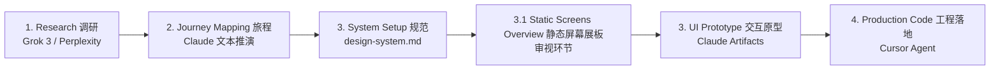

# 🚀 敏捷 Vibe Coding 全流程手册 (Agile Vibe Coding Flow Map)

## 📌 全局流程图 (Pipeline Overview)

```text
1. Research (调研)   ➔  2. Journey Mapping (旅程)  ➔  3. System Setup (规范)
   (Grok 3 / Perplexity)    (Claude 文本推演)             (design-system.md)
                                                                 │
4. Production Code (工程落地)  ⬅   3. UI Prototype (交互原型) ⬅──┘
      (Cursor Agent)            (Claude Artifacts)
                                       ▲
                                       │ 增加审视环节：
                                3.1 Static Screens Overview (静态屏幕展板)
```

## 🗂️ 阶段一览 (Stages at a Glance)

| 阶段 | 名称 | 工具 / 产出载体 |
|---|---|---|
| 1 | Research (调研) | Grok 3 / Perplexity |
| 2 | Journey Mapping (旅程) | Claude 文本推演 |
| 3 | System Setup (规范) | design-system.md |
| 3.1 | Static Screens Overview (静态屏幕展板) | 审视环节，进入交互原型之前 |
| 3 | UI Prototype (交互原型) | Claude Artifacts |
| 4 | Production Code (工程落地) | Cursor Agent |

## 🔁 流程图 (Mermaid)


